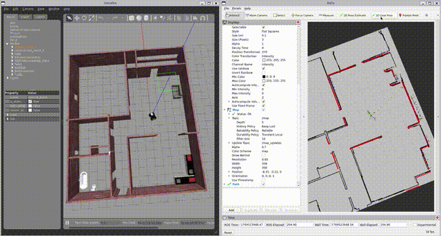
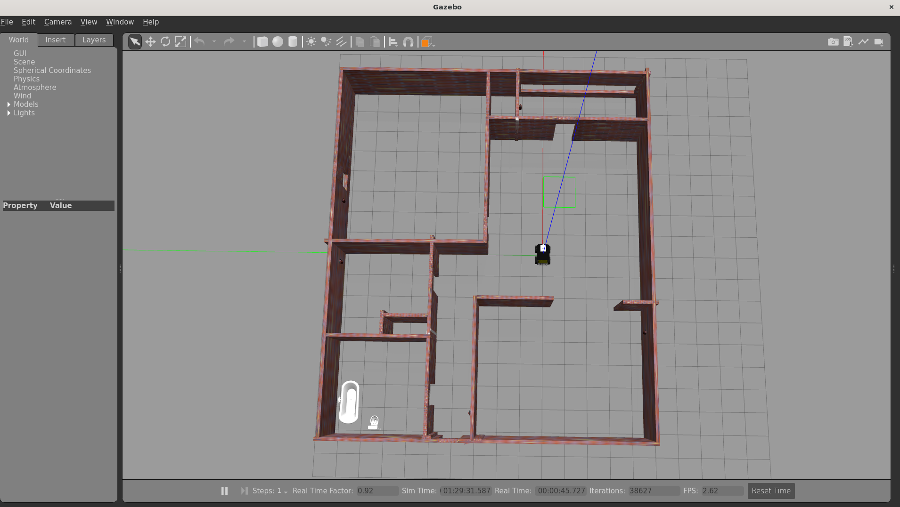
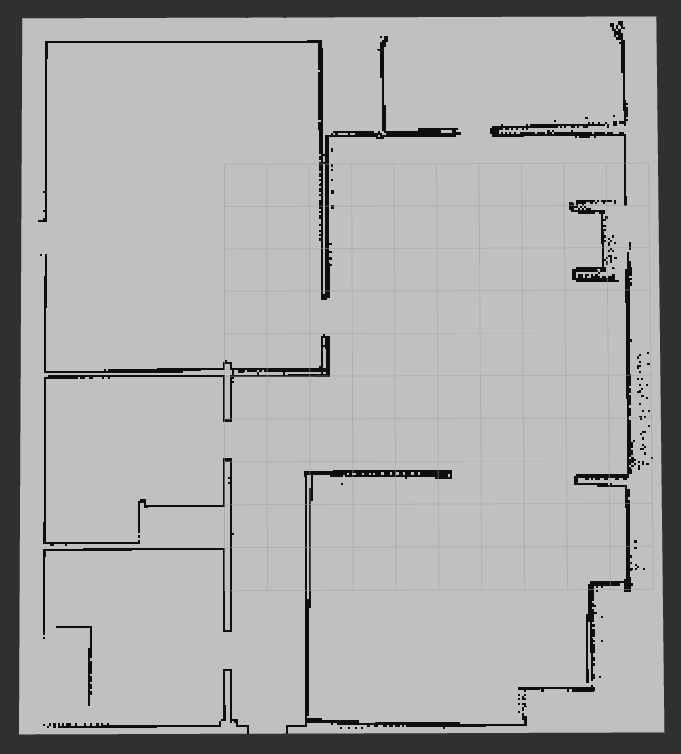
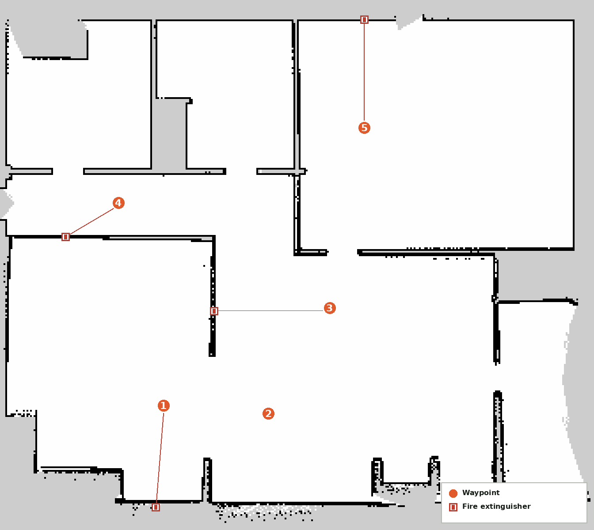

# Husky AI Inspection (Simulation)

## Overview

This repository contains a **simulation-first inspection stack for the Clearpath Husky UGV**, built using **ROS 2, Gazebo, and Nav2**.
The stack now covers full multi-waypoint mission execution — a behavior-tree mission runner, a mission interface node, and a web dashboard for launching missions and viewing inspection reports — on top of the navigation/localization foundation.

Development is intentionally incremental: navigation reliability first, then mission orchestration and reporting. AI-based detection is under active development and not covered in this README yet.

---

## About This Repository

This project is based on the open-source **Husky UGV ROS 2 stack** maintained by **Clearpath Robotics**.

Original repository:
https://github.com/husky/husky (humble-devel)

This repository extends the upstream stack with:
- Custom Gazebo simulation environments
- Navigation and localization workflows
- Waypoint recording logic
- A behavior-tree-driven multi-waypoint mission system, with mission start/cancel services
- A web dashboard (FastAPI backend + frontend) for driving missions, teleop, and viewing generated inspection reports

---

## Current Status

- Gazebo simulation with Husky: ✅ Working
- Custom construction-site world: ✅ Working
- Nav2 localization using a static map: ✅ Working
- Automatic initial pose setting: ✅ Working
- Navigation stack bring-up: ✅ Working
- Waypoint recording via RViz: ✅ Working
- Single and multi-waypoint mission execution (behavior tree): ✅ Working
- Mission cancel support: ✅ Working
- Web dashboard for mission control and report generation: ✅ Working
- AI-based inspection (vision / detection pipeline): 🚧 In progress

---

## Repository Structure

```text
husky_ai_inspection/
├── husky_bringup/              # Top-level bring-up launch files
├── husky_gazebo/                # Gazebo simulation and world files
├── husky_nav2/                  # Nav2 maps, parameters, and configuration
├── husky_navigation/            # Navigation-related configuration
├── husky_init_pose/             # Automatic initial pose node
├── husky_waypoint_recorder/     # Waypoint recording and single-point navigation nodes
├── husky_mission_interface/     # Mission entry point: /start_mission, /start_mission_sequence, cancel
├── husky_mission_bt/            # Behavior-tree mission runner (nav + inspect + report per waypoint)
├── husky_msgs/                  # Shared messages/services (MissionGoal, MissionResult, StartMissionSequence, ...)
├── husky_dashboard/              # FastAPI backend + web frontend for mission control and reports
├── husky_vision_detector/       # Vision/detection pipeline (in progress, not covered here)
├── husky_base/ husky_control/ husky_description/
├── husky_desktop/ husky_models/ husky_robot/
├── husky_simulator/ husky_viz/  # Upstream Clearpath Husky ROS 2 packages
```

## Prerequisites

- ROS 2 (tested with **Humble**)
- Gazebo
- Nav2
- BehaviorTree.CPP v3 (`behaviortree_cpp_v3`) for `husky_mission_bt`
- `yaml-cpp`
- Python 3 with `fastapi`, `uvicorn`, `rclpy` for `husky_dashboard`
- Clearpath Husky simulation packages
- `colcon` build tools

Make sure your ROS environment is sourced:

```bash
source /opt/ros/<ros-distro>/setup.bash
source ~/husky_ws/install/setup.bash
```

## Build Instructions

From your workspace root:

```bash
colcon build
source install/setup.bash
```

## Instructions

The stack now starts with just two commands: one bring-up launch file for the full simulation/navigation/mission stack, and one command for the web dashboard.

### Step 1 – Launch the Full Stack

```bash
ros2 launch husky_bringup husky_bringup.launch.py
```

This single launch file (`husky_bringup/launch/husky_bringup.launch.py`) brings up everything needed to run a mission:

- Gazebo simulation (default world: `construction_site_fire_extuinguisher.world`)
- Nav2 localization (AMCL against `my_map.yaml`)
- Automatic initial pose setting (`husky_init_pose`)
- Nav2 navigation stack
- Waypoint executor (`husky_waypoint_recorder/go_to_waypoint`)
- Vision/detection nodes (`image_capture_service`, `yolo_fire_extinguisher_node`)
- Mission behavior tree runner (`husky_mission_bt`) and mission interface node (`husky_mission_interface`)

It accepts optional launch arguments to override defaults:

```bash
ros2 launch husky_bringup husky_bringup.launch.py \
  use_sim_time:=true \
  world_path:=/path/to/world \
  map:=/path/to/map.yaml \
  params_file:=/path/to/nav2_params.yaml
```

Once running, launch RViz separately if you want visualization:

```bash
rviz2
```

Start a mission over the `/start_mission_sequence` service for multiple waypoints (or `/start_mission` for a single waypoint). The BT loops per waypoint: navigate → inspect → publish mission-complete, until the sequence finishes. A running mission can be cancelled via the corresponding cancel service exposed by `mission_interface_node`.

### Step 2 – Web Dashboard (mission control, teleop, reports)

```bash
cd husky_dashboard/backend
uvicorn main:app --reload
```

This single command starts the FastAPI backend and serves the frontend (the backend mounts the `husky_dashboard/frontend` directory as static files), so there's no separate frontend server to run. The dashboard exposes endpoints for starting/stopping missions, teleop over a WebSocket, image capture, and inspection report generation/browsing (`/go`, `/stop`, `/capture`, `/inspect`, `/stop_mission`, `/status`, `/missions`, `/generate_report`, `/ws/teleop`, among others).

---

## Demos
<!--  -->

### Environment

| Gazebo world | SLAM occupancy map |
|---|---|
|  |  |

### Inspection waypoints

Point 1–5 plotted on the SLAM map from `husky_waypoint_recorder/config/waypoints.yaml`, with the wall-mounted fire extinguishers Points 1, 3, 4, and 5 inspect (Point 2 currently reports missing).



### Videos

📹 **Full autonomous mission** — multi-waypoint mission run from the web dashboard, Gazebo and UI side by side, through report/image generation on completion.

<video src="videos/full_autonomous_demo.mp4" controls width="720"></video>

📹 **Single goal via manual control** — dashboard's Manual Control panel driving the Husky to one waypoint.

<video src="videos/individual_goal_from_manual_control.mp4" controls width="720"></video>

📹 **Manual goal + stop trigger** — sending a single goal and triggering navigation stop from the dashboard.

<video src="videos/individual_goal_from_manual_control_with_stop_trigger.mp4" controls width="720"></video>

> If these players don't render on your Git host, the `.mp4` files are still in `videos/` and can be opened/downloaded directly.
